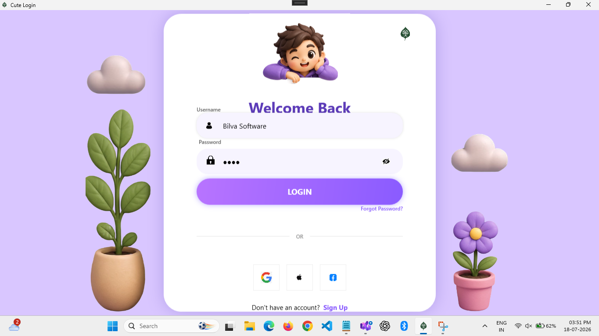
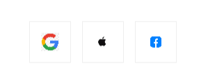
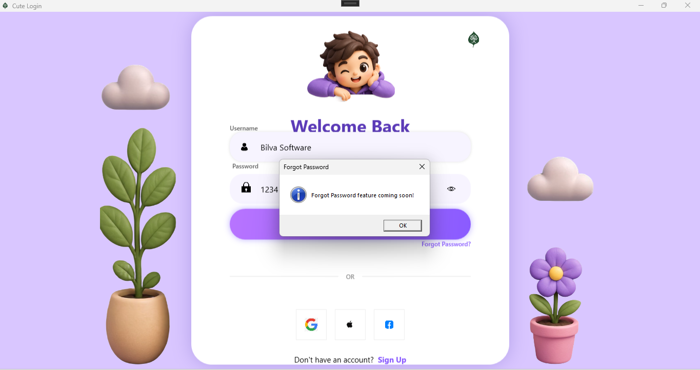
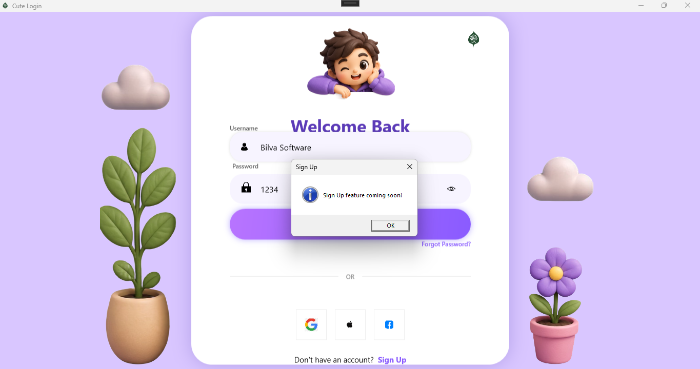
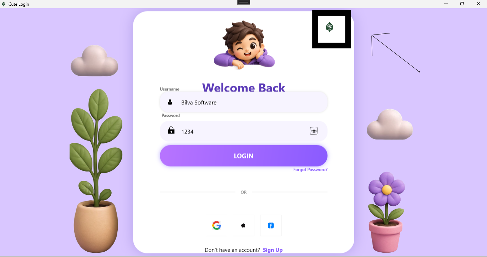
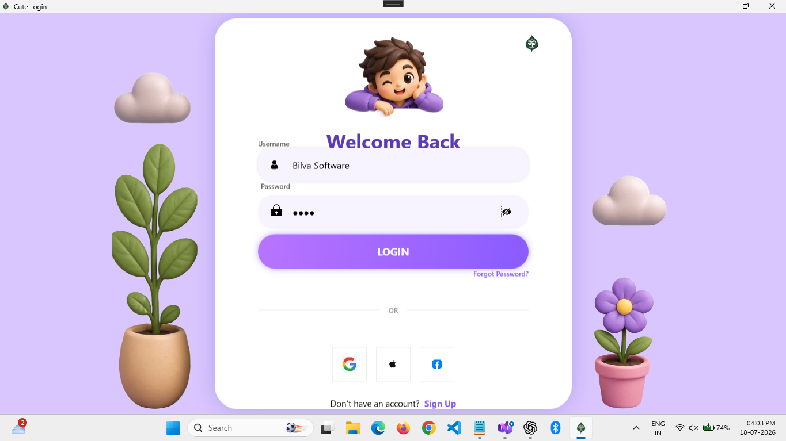

<p align="center">
  
</p>

 # ✨🌸 ModernLoginUI

<p align="center">


</p>

A modern, cute, and responsive **WPF Login UI** built with **C#** and **.NET 8**. This project features a clean design inspired by modern mobile login screens with rounded controls, gradient buttons, password visibility toggle, and social login buttons.

---

# 📸 Preview



---

# ✨ Features

- 🎨 Modern Cute Login UI
- 💜 Purple Gradient Theme
- 👤 Username TextBox
- 🔒 PasswordBox
- 👁 Show / Hide Password
- 📝 Username & Password Placeholder
- 🔗 Clickable Social Login Buttons
  - Google
  - Apple
  - Facebook
- ❓ Clickable Forgot Password (Demo)
- 📝 Clickable Sign Up (Demo)
- 📱 Responsive Layout
- 🖼 Custom Assets & Icons
- 🌿 Bilva Software Branding
- ⚡ Built using WPF (.NET 8)

---

# 🛠 Technologies Used

- C#
- WPF
- XAML
- .NET 8
- Visual Studio 2022 or later

---

# 📂 Project Structure

```text
ModernLoginUI
│
├── Assets
│   ├── Images
│   └── Icons
│
├── Screenshots
│   ├── Banner.png
│   ├── LoginUI.png
│   ├── PasswordVisible.png
│   ├── SocialButtons.png
│   ├── ForgotPassword.png
│   ├── SignUp.png
│   ├── BilvaLogo.png
│   └── FullApplication.png
│
├── App.xaml
├── App.xaml.cs
├── MainWindow.xaml
├── MainWindow.xaml.cs
├── README.md
├── LICENSE
├── .gitignore
├── BilvaLoginUI.csproj
└── BilvaLoginUI.sln
```

---

# 🚀 Getting Started

## Requirements

- Visual Studio 2022 or later
- .NET 8 SDK

## Clone the Repository

```bash
git clone https://github.com/bilvasoftware/Bilva-Login-UI.git
```

## Open

Open the solution using **Visual Studio**.

## Run

Press **F5** or click **Start** to run the application.

---

# 📌 Current Features

- Modern WPF Login UI
- Password Show / Hide
- Username & Password Placeholder
- Clickable Login Button
- Google Login Button (Demo)
- Apple Login Button (Demo)
- Facebook Login Button (Demo)
- Forgot Password Button
- Sign Up Button
- Responsive Window
- Bilva Software Branding

---

# 🖼 Screenshots

## Login UI


---

## Password Visibility


---

## Social Login Buttons



---

## Forgot Password



---

## Sign Up



---

## Bilva Software Logo



---

## Full Application



---

# 🔮 Future Improvements

- SQL Server Authentication
- Google OAuth Login
- Apple OAuth Login
- Facebook OAuth Login
- Register Window
- Forgot Password Window
- User Dashboard
- Dark Theme
- Light Theme
- Smooth UI Animations
- Remember Me
- Multi-language Support

---

# 👨‍💻 Developer

**Tarunika K**

Developed under **Bilva Software**

---

# 📄 License

This project is licensed under the **MIT License**.

---

# 🌍 Follow Bilva Software

### 💻 GitHub
https://github.com/bilvasoftware

### 💼 LinkedIn
https://www.linkedin.com/in/bilva-software-aa532a421/

### ▶️ YouTube
https://www.youtube.com/@bilvaSoftware

### 📢 Telegram
https://t.me/bilvasoftware

### ✍️ Blog
https://bilvasoftware.blogspot.com/

### 📧 Email
bilvasoftware@gmail.com

---

# ⭐ Support

If you found this project useful:

⭐ Star this repository

🍴 Fork this repository

💡 Share your feedback

📢 Share it with your friends and developers.

---

## ❤️ If you like this project, don't forget to leave a ⭐ on GitHub!

---

<p align="center">

**© 2026 Bilva Software | Made with ❤️ using WPF and C#**

</p>
